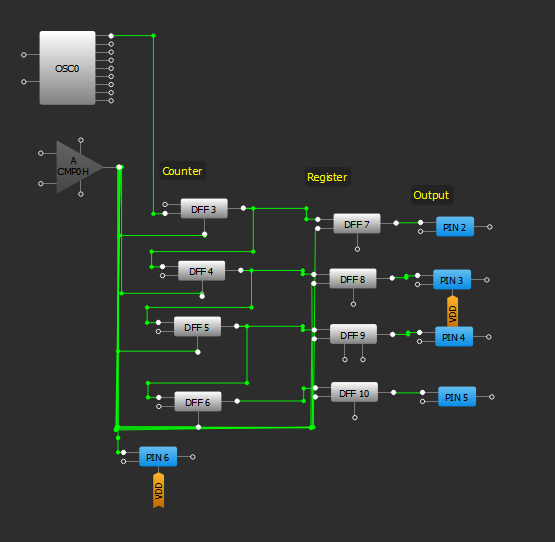
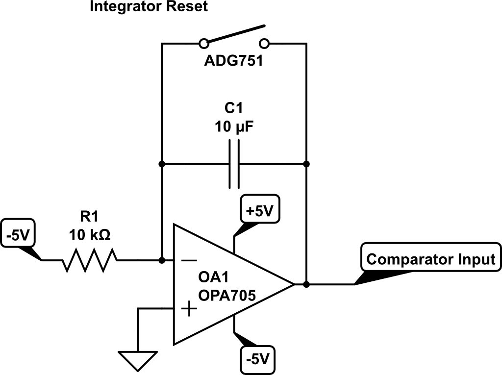

# Example: Single Slope Converter

Useing the unique mixed signal capabilities of the SLG46826 we can make a Single slope A/D converter.

## How single slope ADCs work
Single slope ADCs use an op-amp integrator as a ramp generator to generate a voltage that increases at a predictable rate; -Vref/RC, the output is connected to a comparator that checks if the ramp generator output has reached the input voltage. The controller counts the number of clock cycles until the ramp reaches the input voltage, based on the number of clock cycles and the ramp rate you can calculate the input voltage.

## Implmenting one using the SLG46826 shield

### Parts

* SLG46826 Shield
* Arduino Uno
* ADG751 Switch (and some SOT-23 TO 6 DIP adapter boards)
* LMC7660 -vref generator (or isolated power supply configured for -5V)
* OPA705 Op-amp
* Some passives

### Digital logic

The internal logic of the SLG46826 can be configured to power the Single slope converter using an internal comparator to check the ramp generator output vs. the input voltage. While the ramp voltage is lower than the input the counter counts based on the internal clock, then when it hits the voltage the current count is shifted to the internal register to be read via a parallel output onto the Arduino while the counter is reset.

### Ramp generator

Below is the ramp generator circuit with the conections from the SLG46826, the -5V rail will need to be generated from the LMC7660. The rampe rate is 50mV/ms.

### Caculating the input voltage

The output voltage is (clock frequency)(count)(ramp rate).