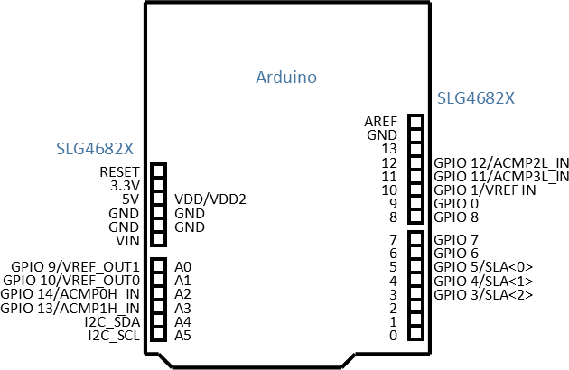
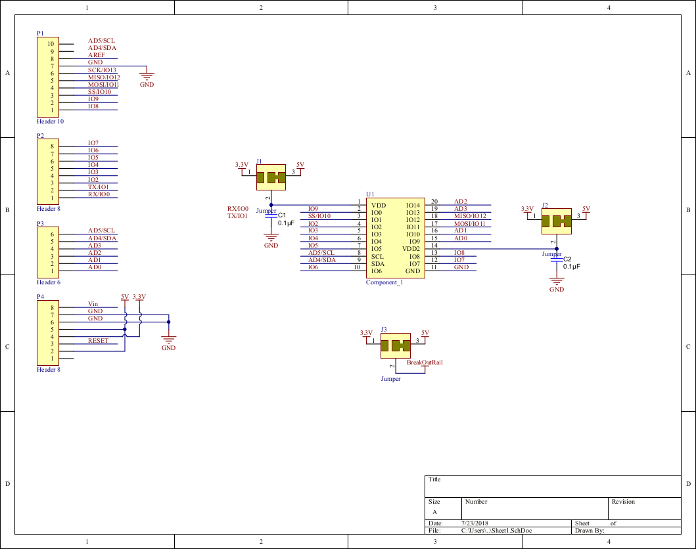

# Shield Reference

## Usage tips

You can cut and solder the VDD and VDD2 pins respectively to connect them to 5V or 3.3V or an external power supply supplying a voltage in between. You can also cut and solder the Rail jumper to switch the center Rail from providing 5V to providing 3.3V.

## Pinmap

**Arduino IO**| ***SLG4682X Pin***
-----:|:-----
A0|GPIO 9/VREF\_OUT1
A1|GPIO 10/VREF\_OUT0
A2|GPIO 14/ACMP0H\_IN
A3|GPIO 13/ACMP1H\_IN
A4|I2C\_SDA
A5|I2C\_SCL
0|N/A
1|N/A
2|GPIO 2/SLA<3>
3|GPIO 3/SLA<2>
4|GPIO 4/SLA<1>
5|GPIO 5/SLA<0>
6|GPIO 6
7|GPIO 7
8|GPIO 8
9|GPIO 0
10|GPIO 1/VREF IN
11|GPIO 11/ACMP3L\_IN
12|GPIO 12/ACMP2L\_IN
13|N/A
AREF|N/A
SDA|N/A
SCL|N/A

## Schamatic

## PCB Layout

Source PCB docs (in Altium): [SLG4682X-PCB.zip](Files/SLG4682X-PCB.zip)

